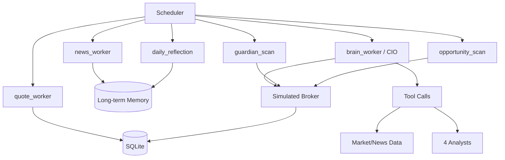

# Quant Agent Battle

A CodeBuddy-powered multi-agent trading system for China A-share research and simulation.

Simple onboarding: prepare your Python environment, set your own CodeBuddy API key, and run.

## Is This Live Trading

Short answer: Real market data + simulated execution. It is not direct broker live order routing.

- Market data:
  - Real-time quotes mainly from http://hq.sinajs.cn
  - Historical daily bars mainly from akshare
  - News and market context from akshare sources
- Execution:
  - Local simulated broker
  - A-share trading rules: T+1, commission, stamp tax, slippage
  - Orders, positions, and equity are persisted in local SQLite

So the decision flow is market-realistic, while execution is still paper/simulated.

## Quick Start

## 1) Environment Setup

Recommended Python 3.10+ (project works with Python 3.12).

Windows PowerShell:

```bash
python -m venv .venv
.\.venv\Scripts\Activate.ps1
pip install -r requirements.txt
```

macOS/Linux:

```bash
python3 -m venv .venv
source .venv/bin/activate
pip install -r requirements.txt
```

## 2) Configure CodeBuddy API

At minimum, set your API key:

```bash
# PowerShell
$env:CODEBUDDY_API_KEY="your_codebuddy_key"
```

Optional custom endpoint (CodeBuddy endpoint is already built in by default):

```bash
$env:CODEBUDDY_ENDPOINT="https://www.codebuddy.cn/v2/chat/completions"
```

## 3) Run the System

```bash
python scripts/run_scheduler.py
```

## 4) Optional Reset

```bash
python scripts/reset_account.py
```

## Model Configuration (Per-Agent Override)

All calls go through CodeBuddy API, while each sub-agent can use its own model.

### Global defaults

- MODEL_DEFAULT
- LLM_MODEL
- EXPERT_MODEL
- NEWS_MODEL
- MARKET_MODEL

### Per-agent overrides

- MODEL_CIO_BRAIN
- MODEL_FINANCIAL_EXPERT
- MODEL_DAILY_REFLECTION
- MODEL_NEWS_WORKER
- MODEL_NEWS_ANALYST
- MODEL_SENTIMENT_ANALYST
- MODEL_FUNDAMENTALS_ANALYST
- MODEL_TECHNICAL_ANALYST

### Bulk JSON override

```bash
$env:MODEL_OVERRIDES_JSON='{"news_worker":"gpt-5.1","technical_analyst":"deepseek-v4"}'
```

## Architecture



## Agent Responsibilities

- quote_worker: refreshes quote snapshots and base equity data.
- news_worker: aggregates news, ranks importance, writes memory.
- brain_worker (CIO): central decision-maker using tools and analyst outputs.
- fundamentals_analyst: valuation and fundamental bias checks.
- sentiment_analyst: crowd sentiment and attention analysis.
- news_analyst: catalyst and risk interpretation from news.
- technical_analyst: trend/structure judgment from indicators.
- guardian_scan: hard risk control and stop-loss logic.
- opportunity_scan: tactical add/entry opportunities.
- daily_reflection: daily review and alpha-aware feedback.

## Scheduler Cadence

- quote_worker: every 5 minutes
- guardian_scan: every 5 minutes (staggered)
- opportunity_scan: every 5 minutes (staggered)
- news_worker: every 15 minutes
- brain_worker: hourly
- daily_reflection: weekdays at 15:10

## Contact

For discussion: tinnel123@outlook.com
