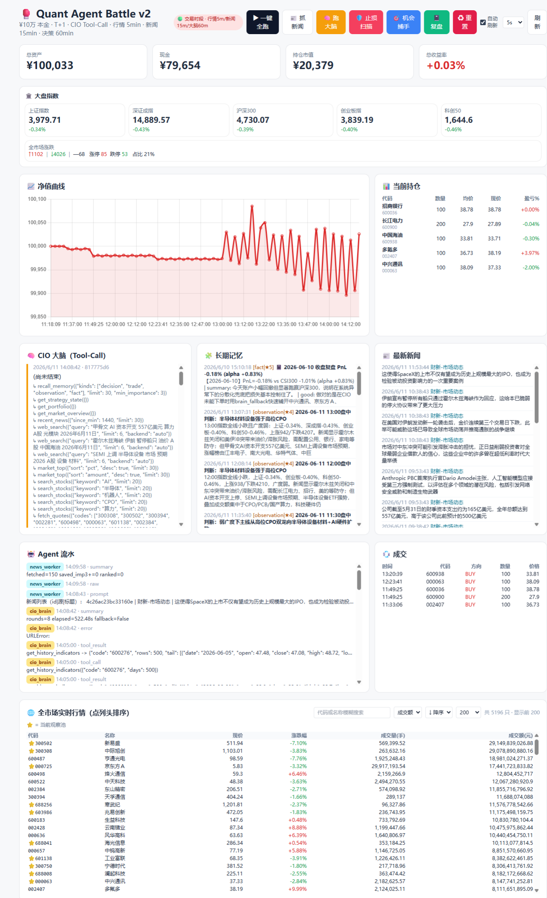
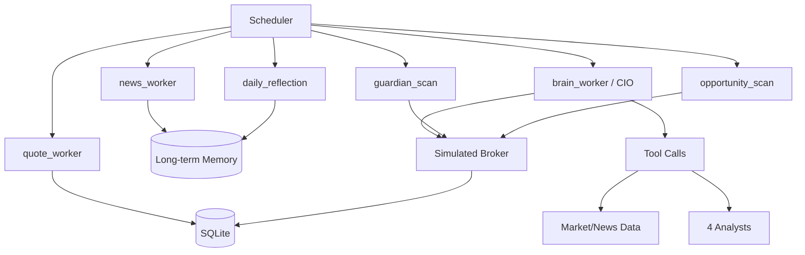

# Quant Agent Battle

A CodeBuddy-powered multi-agent trading system for China A-share research and simulation.

Language:

- English (this page)
- Chinese: [README.zh-CN.md](README.zh-CN.md)

Simple onboarding: set up Python, add your own CodeBuddy API key, and run.

## Demo UI



## What This System Does

- Runs a multi-agent investment workflow on a scheduler.
- Uses LLM agents (via CodeBuddy-compatible API) for reasoning and planning.
- Uses real market data for analysis.
- Executes orders in a local simulated broker (paper execution with A-share rules).

## Is This Live Trading

Short answer: real data, simulated execution.

- Real data side:
	- Real-time quotes mainly from `hq.sinajs.cn`
	- Historical daily bars and market datasets mainly from `akshare`
	- News context aggregated from market/news sources
- Execution side:
	- Local simulated broker, not direct brokerage order routing
	- Enforces T+1, commission, stamp tax, and slippage
	- Persists orders/positions/equity in local SQLite

This gives a realistic research and decision pipeline without placing real broker orders.

## Quick Start

1. Set up environment

Windows PowerShell:

```bash
python -m venv .venv
.\.venv\Scripts\Activate.ps1
pip install -r requirements.txt
```

macOS/Linux:

```bash
python3 -m venv .venv
source .venv/bin/activate
pip install -r requirements.txt
```

2. Configure your CodeBuddy API key

```bash
# PowerShell
$env:CODEBUDDY_API_KEY="your_codebuddy_key"
```

Optional custom endpoint:

```bash
$env:CODEBUDDY_ENDPOINT="https://www.codebuddy.cn/v2/chat/completions"
```

3. Run scheduler

```bash
python scripts/run_scheduler.py
```

4. Optional reset

```bash
python scripts/reset_account.py
```

## Dashboard Buttons (From demo1.png)

Top action buttons and controls:

- `一键全跑` (Run All): triggers quote/news/brain in one go.
- `抓新闻` (Fetch News): runs the news worker only.
- `跑大脑` (Run Brain): runs CIO brain decision cycle.
- `止损扫描` (Stop Scan): runs guardian risk checks.
- `机会捕手` (Opportunity Scout): runs tactical opportunity scan.
- `复盘` (Reflection): runs daily reflection logic.
- `重置` (Reset): resets account state to initial baseline.
- `自动刷新` + interval selector (`5s` etc.): controls front-end auto-refresh cadence.
- `刷新`: manual refresh of current dashboard data.

Main panels in the screen:

- KPI cards: total asset, cash, market value, return.
- Index strip: Shanghai/Shenzhen/CSI300/ChiNext/SSE50 and breadth.
- Equity curve panel: portfolio equity trend over time.
- Current positions table: holdings, average price, last price, PnL.
- CIO Brain panel: tool-call trace and decision narrative.
- Long-term memory panel: stored observations/decisions/facts.
- Latest news panel: recent market/news feed.
- Agent logs panel: worker and tool execution logs.
- Trades panel: executed simulated orders.
- Market snapshot table: sortable full-market view.

## Architecture



## Agent Responsibilities

- `quote_worker`: refreshes quote snapshots and equity base data.
- `news_worker`: aggregates and ranks news, writes key items to memory.
- `brain_worker` (CIO): central decision-making agent with tool calls.
- `fundamentals_analyst`: valuation/fundamental perspective.
- `sentiment_analyst`: attention and sentiment perspective.
- `news_analyst`: catalyst/risk interpretation from news.
- `technical_analyst`: indicator/trend perspective.
- `guardian_scan`: stop-loss and portfolio risk control.
- `opportunity_scan`: tactical add/entry opportunity logic.
- `daily_reflection`: end-of-day review and learning feedback.

## Scheduler Cadence

- `quote_worker`: every 5 minutes
- `guardian_scan`: every 5 minutes (staggered)
- `opportunity_scan`: every 5 minutes (staggered)
- `news_worker`: every 15 minutes
- `brain_worker`: hourly
- `daily_reflection`: weekdays at 15:10

## Model Configuration (Per-Agent Override)

All calls use CodeBuddy-compatible API. You can override model per sub-agent:

- Global defaults: `MODEL_DEFAULT`, `LLM_MODEL`, `EXPERT_MODEL`, `NEWS_MODEL`, `MARKET_MODEL`
- Per-agent overrides:
	- `MODEL_CIO_BRAIN`
	- `MODEL_FINANCIAL_EXPERT`
	- `MODEL_DAILY_REFLECTION`
	- `MODEL_NEWS_WORKER`
	- `MODEL_NEWS_ANALYST`
	- `MODEL_SENTIMENT_ANALYST`
	- `MODEL_FUNDAMENTALS_ANALYST`
	- `MODEL_TECHNICAL_ANALYST`
- Bulk JSON override:

```bash
$env:MODEL_OVERRIDES_JSON='{"news_worker":"gpt-5.1","technical_analyst":"deepseek-v4"}'
```

## Contact

tinnel123@outlook.com
