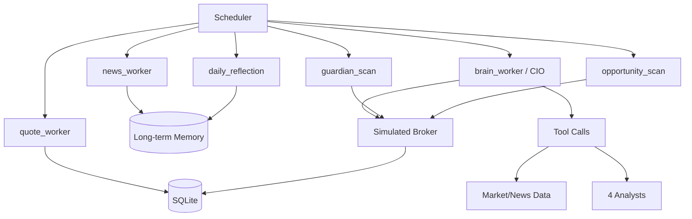

# Quant Agent Battle

基于 CodeBuddy 的多 Agent A 股交易系统。

语言切换：

- 英文（默认主页）：[README.md](README.md)
- 中文（当前页）

核心体验：简单上手，只需要配置好 Python 环境和你自己的 CodeBuddy API Key 即可运行。

## 这是不是实盘

结论：这是 真实行情驱动 + 模拟撮合执行，不是券商账户实盘下单。

- 行情数据：
  - 实时行情优先来自 http://hq.sinajs.cn
  - 历史日线主要来自 akshare
  - 新闻与市场信息来自 akshare 聚合源
- 交易执行：
  - 使用本地模拟 broker
  - 按 A 股规则执行 T+1、手续费、印花税、滑点
  - 订单、持仓、净值都写入本地 SQLite

这意味着系统研究逻辑接近真实交易流程，但不会直接连券商下真单。

## 快速开始

## 1) 环境准备

推荐 Python 3.10+（当前项目在 Python 3.12 可运行）。

Windows PowerShell:

```bash
python -m venv .venv
.\.venv\Scripts\Activate.ps1
pip install -r requirements.txt
```

macOS/Linux:

```bash
python3 -m venv .venv
source .venv/bin/activate
pip install -r requirements.txt
```

## 2) 配置 CodeBuddy API

至少需要设置你的 API Key：

```bash
# PowerShell
$env:CODEBUDDY_API_KEY="your_codebuddy_key"
```

可选：自定义 endpoint（默认已内置 CodeBuddy endpoint）

```bash
$env:CODEBUDDY_ENDPOINT="https://www.codebuddy.cn/v2/chat/completions"
```

## 3) 启动系统

```bash
python scripts/run_scheduler.py
```

## 4) 可选：重置账户

```bash
python scripts/reset_account.py
```

## 模型配置（支持每个子 Agent 单独改模型）

默认全部通过 CodeBuddy API 调用，只是不同 Agent 可以用不同 model 参数。

### 全局默认

- MODEL_DEFAULT
- LLM_MODEL
- EXPERT_MODEL
- NEWS_MODEL
- MARKET_MODEL

### 子 Agent 级别覆盖

- MODEL_CIO_BRAIN
- MODEL_FINANCIAL_EXPERT
- MODEL_DAILY_REFLECTION
- MODEL_NEWS_WORKER
- MODEL_NEWS_ANALYST
- MODEL_SENTIMENT_ANALYST
- MODEL_FUNDAMENTALS_ANALYST
- MODEL_TECHNICAL_ANALYST

### 一次性 JSON 覆盖

```bash
$env:MODEL_OVERRIDES_JSON='{"news_worker":"gpt-5.1","technical_analyst":"deepseek-v4"}'
```

## 架构说明



## 每个 Agent 在干什么

- quote_worker：定时刷新行情快照与净值基础数据。
- news_worker：抓新闻并做重要性分级，写入长期记忆。
- brain_worker（CIO）：主决策 Agent，调工具、调分析师、生成交易决策。
- fundamentals_analyst：基本面倾向判断。
- sentiment_analyst：情绪与热度判断。
- news_analyst：新闻催化与风险解读。
- technical_analyst：技术面结构判断。
- guardian_scan：规则风控，止损与组合风险控制。
- opportunity_scan：机会捕手，做加仓/试仓类动作。
- daily_reflection：每日复盘，总结 alpha 与经验。

## 调度频率

- quote_worker：每 5 分钟
- guardian_scan：每 5 分钟（错峰）
- opportunity_scan：每 5 分钟（错峰）
- news_worker：每 15 分钟
- brain_worker：每小时
- daily_reflection：工作日 15:10

## 联系方式

交流请联系：tinnel123@outlook.com
